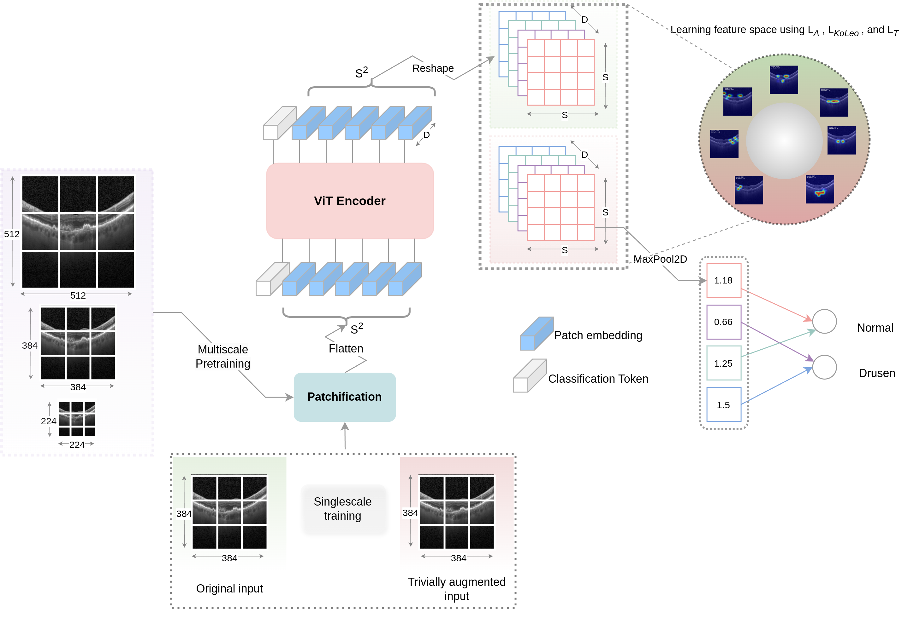

# PiPViT: Patch-based Visual Interpretable Prototypes for  Analysis

This repository presents the PyTorch code for PiPViT. 

**Main Paper at arxiv**: ["PiPViT: Patch-based Visual Interpretable Prototypes for Retinal Image Analysis"](https://www.sciencedirect.com/science/article/pii/S1746809426000996) introduces PiPViT in retinal OCT B-scans classification.\
The paper is published in Biomedical Signal Processing and Control.


PiPViT is an interpretable prototype-based model that learns to classify retinal OCT B-scans using only image-level labels.
Built on transformer architecture, PiPViT captures long-range dependencies between patches to learn robust, human-interpretable prototypes that approximate lesion extent using only image-level labels, helping clinicians to better understand diagnostic outcomes.
Additionally, by leveraging contrastive learning and the flexibility of vision transformers in processing images in different resolutions, PiPViT generates activation maps that effectively localize biomarkers of any size.


PiPViT: The ViT encoder extracts patch representations from the input image at a given resolution. Pretraining is conducted using three different image resolutions, with a consistent patch size and adaptively resized positional embeddings.
The sequence of patches is reshaped into S × S × D feature maps, where the pooled value of each feature map represents presence scores. Contrastive learning, guided by alignment (LA), tanh-loss LT , and KoLeo (LKoLeo) losses, clusters similar features that might represent a single biomarker together in the latent space.
Tanh-loss prevents trivial solutions and feature collapse. Finally, a sparse linear layer connects learned part-prototypes to classes, making the model’s output interpretable as a scoring sheet.

### Required Python Packages:
* [Python](https://www.python.org/downloads/) (3.8.5)
* CUDA (11.1)
* [PyTorch](https://pytorch.org/get-started/locally/) (1.13)
* [torchvision](https://pytorch.org/vision/stable/index.html)(1.14)
* timm (0.5.4)
* PIL(9.1.1)
* openCV (4.6.0)
* numpy (1.21.6)

### Dataset
The dataset used in the paper are publicly available. The code can be run on any dataset with image-level labels. The dataset should be organized in the following format:
```
dataset
│   test
│   │   class1
│   │   │   image1.png
│   │   │   image2.png
│   │   class2
│   │   │   image1.png
│   │   │   image2.png
│   train
│   │   class1
│   │   │   image1.png
│   │   │   image2.png
│   │   class2
│   │   │   image1.png  
│   │   │   image2.png
│   val
│   │   class1
│   │   │   image1.png
│   │   │   image2.png
│   │   class2
│   │   │   image1.png
│   │   │   image2.png
```
The code for creating datasets is available in [data_utils.py](utils/data_utils.py).
The splits for the datasets used in the paper are available in the [annotations](annotations) folder.


### Pretraining PiPViT
PiPViT can be pretrained on any dataset, however, we used the same training data. The function for pretraining is `pretrain` in the [train.py](train_files/train.py) file. The code can be run using the following command:
The pretraining can be done in two ways: 
```bash
 # single scale pretraining that only benefits from contrastive learning
    python Smain.py --config_path /base_path/PiPViTV2/config/Pretrain/Pretrain_224/OCTDrusen/Sconfig_patch16_224.yaml
 # multi-scale pretraining that benefits from both contrastive learning and multi-resolution learning
    python Smain_multi_scale_pretrain.py --config_path /base_path/PiPViTV2/config/Pretrain/Pretrain_Multi/OCTDrusen/Sconfig.yaml
```
The variables required for the training are defined in the configuration file. The configuration file for the pretraining is available in the [config](config/Pretrain) folder.
The resolutions used for the multi-resolution pretraining are defined under variable `img_resolutions` in [Smain_multi_scale_pretrain.py](mains/Smain_multi_scale_pretrain.py).

### Fine-tuning PiPViT
PiPViT can be fine-tuned on any dataset. The function for fine-tuning PiPViT is `train_val_all_losses` in the [train.py](train_files/train.py) file. The code can be run using the following command:
```bash 
    python Smain.py --config_path /base_path/PiPViTV2/config/Train/train/OCTDrusen/Sconfig.yaml
```
The variables required for the training are defined in the configuration file. The configuration file for the fine-tuning is available in the [config](config/Train) folder.

### Interpreting the Results
The code for interpreting the results is available in the [Smain_vis.py](mains/Smain_vis.py) and [Smain_vis_Squares.py](mains/Smain_vis_Squares.py). The code can be run using the following command:
```bash
    python Smain_vis.py --config_path /base_path/PiPViTV2/config/Interpretation/OCTDrusen/Sconfig.yaml
```
### Drusen Detection
The code for drusen detection is available in the [Drusen_Prototype_Eval.py](mains/Drusen_Prototype_Eval.py). The code can be run using the following command:
```bash
    python Drusen_Prototype_Eval.py --config_path /base_path/PiPViTV2/config/Vis/OCT5K/Sconfig.yaml
```
**Note**: The data splits for `OCTDrusen` dataset is available in annotations folder along with the list of samples used for the drusen detection task for [OCT5K](https://www.biorxiv.org/content/10.1101/2023.03.29.534704v1.full.pdf) dataset ([all_bounding_boxes_drusen.csv](annotations/OCT5K/all_bounding_boxes_drusen.csv)).
More details on the dataset can be found in the paper.

## BibTex citation:
If you find this code useful, please consider citing the following paper:
```
@article{pipvitoghbaie2025,
  title={{PiPViT}: Patch-based Visual Interpretable Prototypes for Retinal Image Analysis},
  author={Oghbaie, Marzieh and Araujo, Teresa and Schmidt-Erfurth, Ursula and Bogunovic, Hrvoje},
  journal={Preprint},
  year={2025}
}
```

## Acknowledgements

PiPViT code is mainly based on PiP-Net, along with timm, and DINOv2. We thank the authors for making their code available.

* https://github.com/M-Nauta/PIPNet
* https://timm.fast.ai
* https://github.com/facebookresearch/dinov2

For baseline models, we used the following repositories:

* https://github.com/cfchen-duke/ProtoPNet
* https://github.com/gmum/ProtoPShare
* https://github.com/M-Nauta/ProtoTree
* https://github.com/zju-vipa/ProtoPFormer
* https://github.com/B-cos/B-cos-v2
